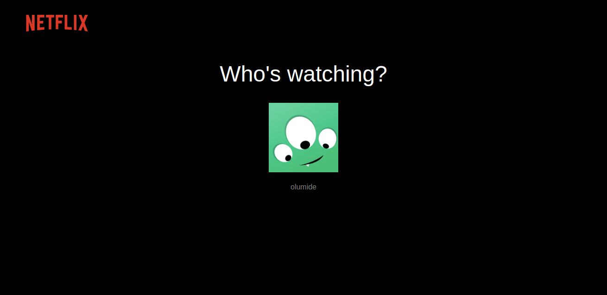
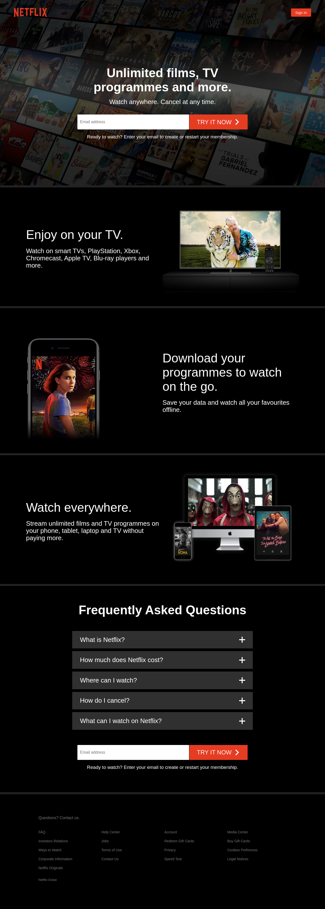

## Netflix

This application (a Netflix clone) was built using React (Custom Hooks, Context), Firebase & Styled Components.

## Contents
- [About](#About)
- [More Features in the App](#More-Features-in-the-app)
- [Screenshots](#Screenshots)
- [Built with](#Built-with)
     - [Core stack](#core-stack)
     - [Third party APIs](#third-party-apis)
- [Run locally](#Run-locally)
- [Deployment](#Deployment) 
- [Author](#Author) 
- [Contributing](#Contributing)
- [License](#License)

## About 
Check all features this app offers:

Built-in with the following pages: sign in, sign up, browse & lastly the homepage. There are four different pages, some using protected routes with auth listeners. Firebase firestore handles all the data and that data is retrieved using a custom hook; authentication is used on all pages, which is handled by Firebase as well.

Easy searching for contents made easy with fuse.js. It is mobile friendly, web accesible and works on all major browsers.

Compound components (just a design pattern) used to build the components, and there's over 10 cases in the app. The styling is all handled via styled components. Testing was easily done thanks to the styled components.

## More Features in the App
  - mobile support  
  - accessibility
  - thorough modularity and organization
  - the persistent session was done using local storage
  - several checks to prevent unauthorized access
  - unit and integration test done
  - many more - find out by checking the app by running it locally

or check it out  here: ............

test and sign-in to see and feel the app

## Screenshots
Netflix Browse Page:  
  

Netflix Browse Loading Page:  
  

Netflix Home Page:  
  

## Built with

#### Core Tech
- [React](https://github.com/facebook/react)
- [Styled-components](https://styled-components.com/)
- [Firebase](https://firebase.google.com/)
- [Fuse](https://fusejs.io/)

#### APIs
- Firebase APIs

Check out [package.json](package.json).

## Run locally
- Clone the project and run `yarn` to add packages.
- Before you start the app, put your `firebase API data` inside lib/firebase.prod.js

or check it out  here: 

## Deployment
- deployed with Netlify
  
  Take a look at the live version [here.....](....)  
## Author
Abeeb Ridwan Olumide

## Contributing
Pull requests are welcome. For major changes, please open an issue first to
discuss what you would like to change.

Please make sure to test as appropriate.

## License
[MIT](LICENSE.md)
